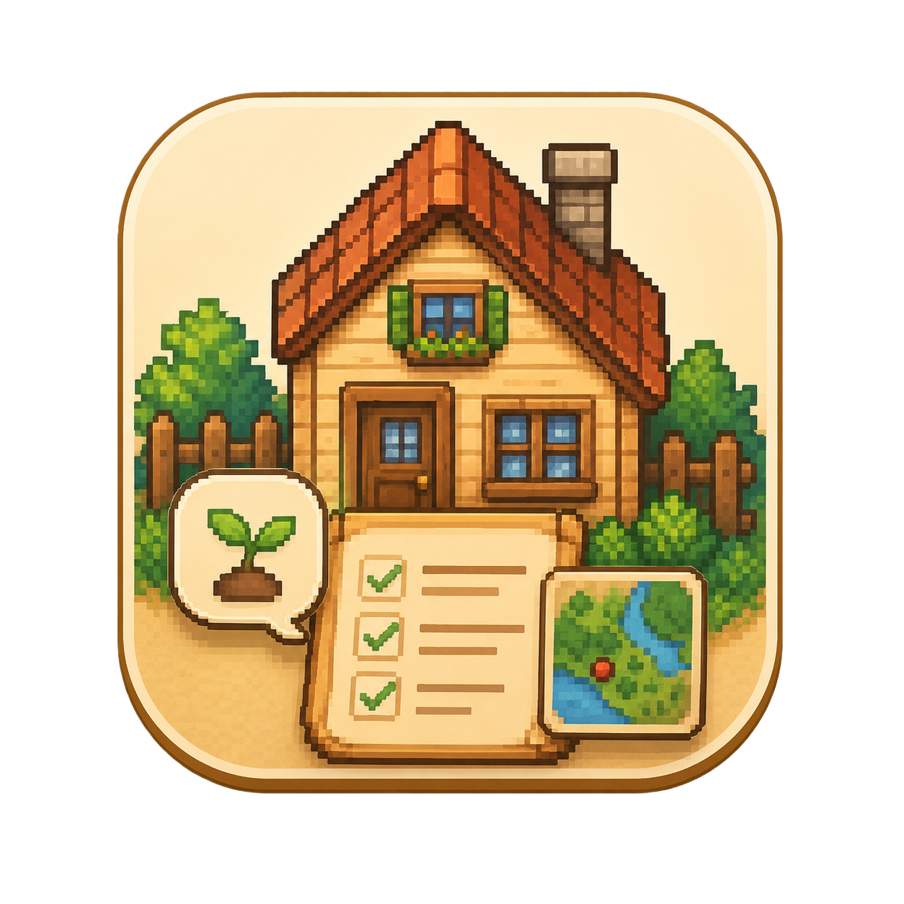

  
  <h1>🚜 Stardew Helper</h1>
  
<b>스타듀밸리 유저들을 위한 스마트한 오버레이 런처 & 모드 매니저</b>

 

Stardew Helper는 스타듀밸리(Stardew Valley)를 더욱 쾌적하게 즐길 수 있도록 돕는 다목적 데스크톱 애플리케이션입니다. 번거로운 모드 관리부터 게임 내 실시간 정보 확인까지, 한 번에 해결하세요!

## ✨ 주요 기능

* **🎮 인게임 오버레이 지원**: 게임 플레이 중에도 단축키(`F3`)를 눌러 오버레이를 띄우고 각종 게임 정보를 바로 확인할 수 있습니다.
* **📦 모드(Mod) 추천 및 관리**: 유용한 추천 모드들을 소개하고, 바로 다운로드 페이지로 연결해 줍니다.
* **📊 실시간 게임 상태 트래킹**: 마지막 저장 시간 등 농장의 최신 상태를 대시보드에서 시각적으로 깔끔하게 확인하세요.
* **🎨 모던하고 아름다운 UI**: 스타듀밸리의 감성을 듬뿍 담은 세련된 인터페이스를 제공합니다.

---

## 📥 다운로드 및 설치

위 링크에 접속하거나 아래의 다이렉트 링크를 클릭하여 사용 환경에 맞는 파일을 바로 다운로드하세요.

1. **설치형 버전 (추천)**: [📥 Stardew Helper_1.1.0_x64-setup.exe 다운로드](https://github.com/2020KDG/Stardew_Helper/releases/download/v1.1.0/Stardew.Helper_1.1.0_x64-setup.exe)
   - 다운로드 후 실행하여 마법사의 안내에 따라 설치를 진행합니다. (바탕화면 바로가기 추가 지원)
2. **무설치 버전 (Portable)**: [📥 StardewHelper_Portable.exe 다운로드](https://github.com/2020KDG/Stardew_Helper/releases/download/v1.1.0/StardewHelper_Portable.exe)
   - 설치 과정 없이 다운로드 후 바로 더블 클릭하여 사용할 수 있습니다.

3. **모드 설치를 권장합니다.** [📥 StardewHelperMod.zip 다운로드](https://github.com/2020KDG/Stardew_Helper/releases/download/v1.1.0/StardewHelperMod.zip)

---

## 🛠️ 개발 환경

이 프로젝트는 빠르고 가벼운 최신 데스크톱 앱 개발 프레임워크를 기반으로 만들어졌습니다.
* **Frontend**: HTML5, CSS3, Vanilla JavaScript
* **Backend / Desktop Binding**: [Tauri](https://tauri.app/), Rust
* **Game Hooking**: C# (SMAPI Mod)

---

### 📝 라이선스
이 프로젝트는 개인적인 용도로 개발되었으며, 스타듀밸리(Stardew Valley)의 공식 소프트웨어가 아닙니다. 스타듀밸리 게임 및 에셋의 모든 저작권은 ConcernedApe에 있습니다.

